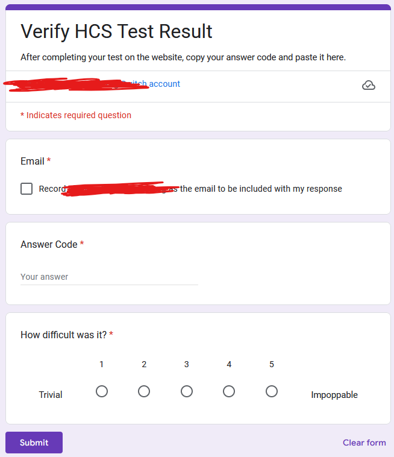

# __these instructions are outdated. working on it, sorry__

# About
## Overview
This repo contains the frontend and the backend of the Honors Computer Science testing program (I'm not in that class- this program is for those students). It, simply put, produces randomly generated tests of Java code, solves them itself, and grades students on their answers. It does this with its own custom bytecode-adjacent code interpreter, and an in-depth and secure API which administers tests and tracks students. It also features an administrator panel, with management and supervision features.

## Goals
The primary goals of this program are:
1. securely administer a Java programming quiz to students
2. have it be secure, and not possible to cheat with inspect element or network inspectors
3. dynamically and randomly generate code questions, and solve them as well
4. provide a secure and useful admin interface

## Collaboration
Read further into this README to learn about the source code and the method of running it. Use the Projects tab to manage issues and track stuff like that. The Uhl Testing program was created by Nate Levison, but Victor Urumov is also a significant collaborator.

# Installation & Development

## Setup
First, make a codespace or a VSCode workspace of this repository, `Cheespeasa1234/uhl_tests`. A development container with the proper configurations are provided for your convenience.

In a terminal, run the following:
```sh
cd frontend
npm install
```

Then, in another terminal, run the following:
```sh
cd backend
deno install
npm install
```

The backend requires Deno. To install it on Linux, run the following:
```sh
curl -fsSL https://deno.land/install.sh
```
Ensure the content it prints is fine, then run it again:
```sh
curl -fsSL https://deno.land/install.sh | sh
```

If you use the codespace, **you do not need to do this**.

## Secrets & Files

In `backend`, create `.env`. 
1. Set `HCST_ADMIN_PASSWORD` to a passphrase for logging into the admin panel.
2. Set `HCST_PORT` to 8081, and set `HCST_HOST` to 127.0.0.1.
3. Set `HCST_GOOGLE_KEY_FILENAME` and leave it blank for now.
4. Set `HCST_FORM_URL` and leave it blank for now.
5. Set `HCST_SPREADSHEET_ID` to the ID (the first part of the URL) of your google sheet.

```env
HCST_ADMIN_PASSWORD=<YOUR ADMIN PASSWORD>
HCST_PORT=8081
HCST_HOST=127.0.0.1
HCST_GOOGLE_KEY_FILENAME=
HCST_FORM_URL=
HCST_SPREADSHEET_ID=
```

In `backend`, create folders `db`, `files`, and `secrets`.

## Google file prerequesites

For the google form / spreadsheet API, make a Google Service account. Get an email for it and give it API access to the Google Sheets API. Get the access key and download the JSON file. More information can be found [here](https://cloud.google.com/iam/docs/keys-list-get). Place that JSON file in the `secrets` folder in the backend.

The testing program uses a google form to take in submissions. First, make a google form with the EXACT same questions as you see below.

_The questions should all be mandatory, it should force authenticated email submission, and should look like below:_



In case the image doesn't work, the form should have the following questions, aside from the mandatory email inclusion:
```
"Answer Code" - short answer
"How difficult was it?" - 1 through 5 -> Trivial - Impoppable
```

Get a shortlink for this form in the Share menu. Take this link, and set the previously mentioned `HCST_FORM_URL` to this url. Once this form is done and accessible to students, link it to a spreadsheet using the responses tab. Take the spreadsheet ID found in the URL of this new spreadsheet, and put it as the value to `HCST_SPREADSHEET_ID`. In that spreadsheet, open the Share menu, and give access to the service account email you created.

## Setting up the database
After installation, the database would be empty. All you need to do is run the following:

```sh
cd backend
deno task seedDb
```

This will create the tables in the database file, and add a hard-coded default preset and default test code to the database. If, in the future, you change the columns, you can use the sequelize migrate feature, or delete the database and run the seed script again.

## Execution

### Development Environment
To run the program, first start the backend:
```sh
cd backend
deno task dev
```

Then, start the backend, in a new terminal:
```sh
cd frontend
npm run dev -- --open
```

### Production Environment
Start the backend:
```sh
cd backend
deno task start
```

Build and start the frontend:
```sh
cd frontend
npm run build
npm run preview -- --port 8082
```

# How to use

## Students
Open the webpage directly. You will be prompted to accept tracking cookies. These cookies simply identify your browser to add an extra layer of identification to the grading process. If the cookie is disabled, your grade may not be tracked.

Next, input your email address. It must be the email address that you intend to submit the google form with. (It is reccommended to use a district / organization email, as the administrator likely expects an email address in that format.)

Press the button to get a test. If this is successful, a notification will appear to let you know. An error will pop up if not. A list of questions will appear below, for you to fill out. Read the question prompt, read the code (if any) provided, and in the textarea, type your response. **It is sensitive to capitalization, whitespace, and newlines.** It is mostly up to your administrator whether or not you will lose score from errors like this.

When you are ready to submit, press Submit, and wait for the pop up. It will provide you with a code, and a link to a google form. Copy the answer code (and ensure it is copied!) and open the form. Fill in the information, and **make sure you are signed in as the same email you provided when beginning the test.** Paste the answer code in where asked. There may be some other questions provided- these are not scored. Submit the google form when you are done, and return to the testing page. Press the okay button, and you are done taking your test!

Note that if you attempt to submit multiple tests, a blank test, distort or corrupt the JSON data, or attempt any other exploit like that, it is tracked and does not work.

## Teachers

Start the server, and open the admin panel. Sign in with the password you set in the settings. When you log in, you will be presented with the admin panel. Most inputs / labels have a tooltip for your assistance- simply hover over, and it will display a tip.

On the side there are three tabs of settings. These are Configure Test, View Status, and Grade Tests. They are explored further below.

### Configure Test
The configure test panel is for modifying the behavior of the test program, and for managing test taking and grading.

#### Starting & Stopping testing
The first options you see will allow you to change whether or not students are taking tests. If this checkbox is disabled, students will be given an error message should they attempt to start a test. Students will still be able to submit tests they started before you unchecked the box.

The next options enable / disable the time limit, and set the amount of minutes for the time limit. When a student starts a test, the time they start is tracked. If they submit after the time limit, it is noted when you open the grading panel. If there is no time limit, this is disabled.

#### Configuring Test Contents
In the second section of the first page, you can modify the contents of the quiz. Each quiz has a certain number of each type of question- for loop, nested for loop, and string. This process is dynamic and new types can be implemented. The input boxes store and allow you to edit the amount of each question that will be administered to students when they start a test.

To save the changes you made to the settings to a preset, select the Save Preset button. Choose either to save it to a pre-existing preset, or make a new preset. The changes you have been making will be stored under that preset and can be loaded later.

When loading a preset, the contents of the preset will overwrite your changes, and become the settings used in new tests. You can load only from a pre-existing preset, and an error will occur if you try to load from a non-existent preset.

The default preset is hard-coded into the server. When you Load from Default, the default configuration will overwrite your current changes, and become the settings used in new tests. This preset can not be edited.

The Load from Current button is used to load the configuration currently in place in the testing system. This can be used if you make a change you want to undo.

To complete your edits, press Set configuration to update the testing program. The changes you make are not saved until you complete the edits.

### View Status
The view status panel has tables of server state information. It stores the google sheet info, and the test responses.

Press refresh to download the sheet again and see the updated data.

### Grade Tests
The grading panel is where you can analyze student responses. In the input box, type in the full email of a student you want to grade- you can find some emails in the View Status panel.

After typing in the email, press Search, and it will search for the student. It will preset the results for the most recent test that follows the following requirements:
1. It must have a valid schema response
2. The emails must match
3. The time of submission must match
4. The answer code must match

Once it finds the most recent valid response, it will grade it and present it to you.

#### Grade Results UI
The top of the grade result displays the email of the student, the amount of questions they got correct, and a percentage grade as well. Below this is some information about when they submitted their test, as well as when it was due for submission. Below this is some information about how much time was remaining when the student subitted their test. This is not factored into the grade at all.

In the box, you will see the grade of the first question. It will tell you the question number, the prompt, and the code provided to the student. Below this are two boxes. The first box is what the student typed in as their response, and the second is what the computer says is the correct answer. If the left border is red on the first box, the answer is incorrect. There is also some text below this to tell you.

On the left and right are buttons to scroll through the questions. Press the right arrow button to get the next question. This cycles through, so you can press right on the last question to get to the first.

## Tour
* Administrator experience
    * Configure Test
        * Setting global time limit
        * Enabling and disabling submission
        * Creating a new preset
        * Editing a different preset
        * Changing the practice test code
        * Creating a final exam
        * Saving changes to test codes
    * View Status
        * Understand the google form table
        * Understand the submission table
    * Grading
        * Find an email / test code we want to grade
        * Put it in the grading interface, and grade the student
        * Understand the grading information
        * Understand each question
* Student experience
    * Being told the secret code
    * Getting a test and confirming
    * Answering questions
    * Submitting answers and using google form